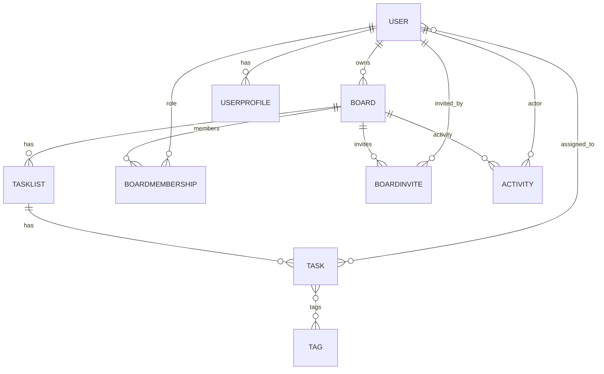
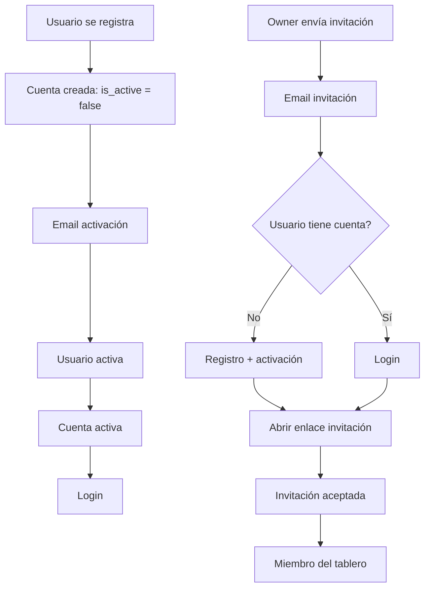

# Task Master

Gestor de tareas estilo Trello con tableros, listas, tareas movibles, etiquetas, prioridades, usuarios y colaboración por roles.

## Funcionalidades

- Home pública tipo landing (`/`) con hero y carrusel.
- Registro, login y logout.
- Activación de cuenta por email con expiración y reenvío.
- Restablecimiento de contraseña con emails personalizados.
- Tableros y listas con orden visual y drag & drop (SortableJS).
- CRUD completo de tableros (crear, ver, editar y eliminar).
- Tareas con prioridad, etiquetas, fecha límite, descripción.
- Asignación de tareas a múltiples usuarios (solo miembros del tablero).
- Progreso general del tablero.
- Filtro principal "Mis tareas" para mostrar solo las tareas asignadas al usuario.
- Búsqueda y filtros por tags y prioridad.
- Filtro por estado (por hacer / en proceso / completadas).
- Paginación por lista (10 tareas por página).
- Exportación de tareas a CSV y JSON (owner/editor).
- Auditoría de actividad (creación, edición, movimientos, membresías, invitaciones) con paginación.
- Panel lateral de actividad con redimensionado y colapsable en móvil.
- Filtros colapsables en móvil y contadores por estado.
- Gestión de miembros y roles (owner/editor/viewer).
- Invitaciones por email con aceptación y caducidad.
- Perfil de usuario con avatar, bio y preferencias de notificaciones.
- Preferencia de cookies por usuario (persistida en backend para cuentas autenticadas).
- Notificaciones por email cuando te asignan una tarea (opt‑in por perfil).
- Notificaciones por email de vencimiento (próximas y vencidas) y cambio de estado.
- Cambio de email con verificación por enlace.
- Páginas legales estáticas: aviso legal, privacidad y cookies.
- Footer extendido con navegación, legal y accesos de cuenta.
- Banner de cookies con 3 opciones:
  - Aceptar todas
  - Solo imprescindibles
  - Rechazar todas (puede afectar sesión/formularios)

## Roles

- **Owner**: control total (gestión de miembros, invitaciones, editar y eliminar tablero).
- **Editor**: puede crear/editar/mover tareas y listas.
- **Viewer**: solo lectura.

## Emails

Plantillas HTML con logo embebido:
- Activación de cuenta
- Confirmación de activación
- Invitaciones
- Asignación de tareas
- Vencimiento de tareas (próximas y vencidas)
- Cambio de estado
- Confirmación de cambio de email
- Reset de contraseña

## Tecnologías

- Django
- SQLite (por defecto)
- Bootstrap 5 + Bootstrap Icons
- SortableJS
- JavaScript vanilla (banner de cookies y UX del tablero)
- SMTP (Gmail en dev)

## Instalación rápida

```bash
python3 -m venv env
source env/bin/activate
pip install -r requirements.txt
env/bin/python manage.py migrate
env/bin/python manage.py runserver
```

## Diagrama de modelos



## Diagrama de flujo (registro, activación e invitaciones)



## Variables de entorno (.env)

```ini
EMAIL_USER=tu_correo@gmail.com
EMAIL_PASS=tu_app_password
SITE_URL=https://tudominio.com
```

## Cumplimiento y cookies

- Banner de consentimiento visible hasta que el usuario elige una opción.
- Para usuarios autenticados, la preferencia se guarda en backend (`UserProfile.cookie_consent`)
  con fecha de actualización (`cookie_consent_updated_at`).
- Endpoint interno de preferencia:
  - `GET /accounts/cookie-consent/`
  - `POST /accounts/cookie-consent/` (JSON: `{ "choice": "all|essential|reject" }`)
- Páginas legales disponibles en:
  - `/legal/aviso-legal/`
  - `/legal/privacidad/`
  - `/legal/cookies/`

## Notificaciones por vencimiento

Se envían con un comando programable:

```bash
python3 manage.py send_task_due_notifications
```

Recomendado: ejecutar cada hora con cron.

## Notas de UI

- Panel de actividad ajustable (drag) y colapsable en móvil.
- Columnas kanban optimizadas para ver más de 3 en pantalla.
- Botón de "Añadir tarea" compacto y centrado.

## Despliegue (producción)

1. Configura `DEBUG=False` y `ALLOWED_HOSTS`.
2. Usa una base de datos robusta (PostgreSQL recomendado).
3. Configura `STATIC_ROOT` y ejecuta:
   ```bash
   env/bin/python manage.py collectstatic
   ```
4. Configura SMTP real (o servicio como SendGrid).
5. Sirve con Gunicorn/Uvicorn y un proxy (Nginx/Apache).

Ejemplo Gunicorn:
```bash
env/bin/gunicorn core.wsgi:application --bind 0.0.0.0:8000
```

## Rutas útiles

- `/` home pública (redirige a tableros si hay sesión iniciada)
- `/boards/` lista de tableros (zona app)
- `/boards/<id>/` detalle del tablero
- `/boards/<id>/edit/` editar tablero (owner)
- `/boards/<id>/delete/` eliminar tablero (owner, POST)
- `/boards/profile/` perfil
- `/accounts/login/`
- `/accounts/password_reset/`
- `/legal/aviso-legal/`
- `/legal/privacidad/`
- `/legal/cookies/`

## Exportación

- CSV: `/boards/<id>/export/csv/`
- JSON: `/boards/<id>/export/json/`
- Actividad: `/boards/<id>/export/activity/`

## Testing

Pruebas básicas incluidas para permisos de CRUD de tableros:

```bash
python3 manage.py test boards
```

## Notas

- Los envíos de email requieren SMTP válido.
- Las invitaciones caducan a los 7 días.
- Activación de cuenta caduca a las 24 horas.
